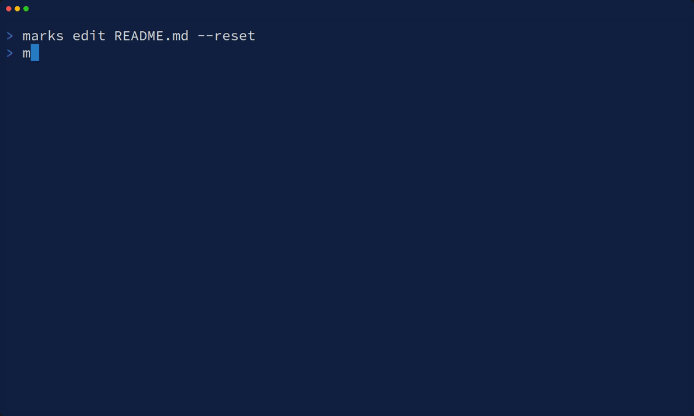

# marks

`marks` marks line of source code and it shows with color.



# How to use

```bash
$ marks view src/main.rs
```

| mode   | key bind | description                    |
|--------|----------|--------------------------------|
| normal | `q`      | quit                           |
| normal | `n`      | jump to next grep matched line |
| normal | `N`      | jump to prev grep matched line |
| normal | `j`      | move to down                   |
| normal | `k`      | move to up                     |
| normal | `g`      | move to top                    |
| normal | `G`      | move to bottom                 |
| normal | `C-d`    | move to down (10 lines)        |
| normal | `C-u`    | move to up (10 lines)          |
| normal | `m`      | mark line and move to down     |
| normal | `M`      | mark line and move to up       |
| normal | `u`      | unmark line and move to down   |
| normal | `U`      | unmark line and move to up     |
| normal | `o`      | optimize spec and write        |
| normal | `/`      | into grep mode                 |
| grep   | `Enter`  | search with input text         |

```bash
line marking cli tool

Usage: marks <COMMAND>

Commands:
  print   Print file with color
  edit    Edit spec file
  view    View file with special window
  status  Show status of all sources
  debug   Debug command
  help    Print this message or the help of the given subcommand(s)

Options:
  -h, --help     Print help
  -V, --version  Print version
```
